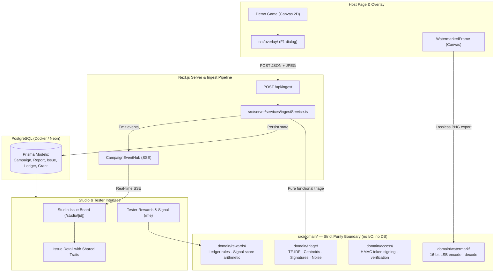

# Repro

Repro turns raw playtest bug reports into clustered, triaged issues a developer can actually fix — with forensic watermarking, reward tokens, and a live triage board, all running offline.


## Live Demo

- **Web**: [https://repro-team-omzo.vercel.app](https://repro-team-omzo.vercel.app)

## Quick Start

Working from a cold clone. Node 20 required (see `.nvmrc`). Runs completely offline.

```bash
cp .env.example .env                          # fill in secrets
pnpm install && pnpm db:up && pnpm db:migrate dev
pnpm dev                                      # http://localhost:3000
```

To seed 328 real fixture reports through the real ingest endpoint:
```bash
pnpm seed
```

## Architecture



The `src/domain/` boundary contains only pure functions: no Prisma, no React, no `fetch`, and no I/O. Enforced by automated test `tests/domain.purity.test.ts`.

## How the Triage Works

Triage collapses incoming bug reports using four distinct signals:

1. **Lexical (TF-IDF)** (weight: 0.30) — Cosine similarity over normalized tokens.
2. **Game State Proximity** (weight: 0.30) — Strict scene match (mismatch is a hard veto) plus Euclidean spatial distance on a bucketed 3D grid.
3. **Log Signature** (weight: 0.25) — Normalised error line signatures with numbers, hashes, and dynamic IDs stripped.
4. **Environment Overlap** (weight: 0.15) — GPU renderer, OS, and browser family tally overlap.

### Thresholds & Fallback
- Combined score **≥ 0.68**: automatically attach report to existing issue cluster.
- Combined score **0.50 – 0.68**: flagged as a *possible duplicate* for studio confirmation.
- Combined score **< 0.50**: promoted as a new unique issue cluster.
- **Rule of Thumb**: *When in doubt, do not merge.* A duplicate issue is a minor inconvenience; a false merge hides a distinct bug.

### In-Memory Computation
IDF tables and cluster centroids are rebuilt entirely in memory on every ingest from cached `Report.tokens` arrays. Nothing about the vector space or centroid positions is persisted to the database. This is a deliberate simplification rather than a shortcut: it keeps the domain pure, guarantees 100% deterministic reproducibility, avoids stale embedding migrations, and requires zero external vector search infrastructure.

## Security Layers

- **Signed Build Access**: HMAC-SHA256 signed access tokens with a 15-minute TTL, cryptographically bound to the tester's User-Agent SHA-256 hash. Copying access links to another device or browser is immediately rejected.
- **NDA Fingerprinting**: Server-side age gate (`birthDate` verification for ≥ 18), storing cryptographic hashes of the signed legal text so neither party can alter terms post-facto.
- **Forensic Watermarking**: Embeds a 16-bit identity (giving a ceiling of **65,535 distinct grants**) into frame pixel luminance (±2 delta). Highly resilient to 2× and 3× downscaling.
- **Lossless vs. Lossy Distinction**: Bug report screenshots are client-compressed JPEGs (≤ 1280px, q0.8) and carry **no watermark**. Only raw, uncompressed PNGs exported via "Export frame for forensics" carry the watermark.
- **Honest Limits**: Client-side watermarking and token validation can be bypassed by an adversary with memory inspection or hardware capture tools. These layers raise the difficulty of casual leaks and establish accountability, not DRM perfection.

## Privacy

- **IP Addresses**: Hashed with a unique deployment salt (`APP_SALT`) prior to storage. Raw IPs are never written to disk or database.
- **Canvas-Only Capture**: Screenshots capture strictly the game's `<canvas>` element via `toDataURL()`. The tester's desktop, other browser tabs, and OS chrome are never accessed.
- **Data Minimization**: `birthDate` is checked in memory during NDA verification and never surfaced on public dashboards.
- **Virtual Claim Tokens**: Bounty rewards ("coins") are fictional claim tokens redeemable for in-game studio perks (alpha keys, credits mentions, cosmetics). They have no monetary exchange mechanism.

## Test Coverage Summary

Repro maintains strict offline test coverage across unit, domain, and UI components:

```bash
# Run domain and UI test suites (186 passing tests)
pnpm test

# Run database integration tests (concurrency & idempotency against Postgres)
pnpm test:integration

# Full CI baseline validation
pnpm typecheck && pnpm lint && pnpm test
```

| Project | Environment | Scope |
|---|---|---|
| `domain` | Node.js | Pure clustering, watermark encode/decode, token HMAC, reward math |
| `ui` | jsdom | React component behavior, IssueRow styling, renderers |
| `integration` | Node.js + Postgres | 50-parallel verify idempotency, sequence allocation, transactions |

## Development Commands

| Command | Action |
|---|---|
| `pnpm dev` | Start Next.js local development server |
| `pnpm build` | Production build |
| `pnpm test` | Run Vitest domain and UI test suites |
| `pnpm test:integration` | Run Postgres integration tests |
| `pnpm typecheck` | Run `tsc --noEmit` under strict TypeScript |
| `pnpm lint` | Run ESLint across all source files |
| `pnpm format` | Run Prettier code formatting |
| `pnpm db:migrate` | Execute Prisma migrations against local Docker Postgres |
| `pnpm db:studio` | Launch Prisma Studio database interface |
| `pnpm seed` | Seed 328 reports via the HTTP ingest API |

## Team

**Team Omzo** — Xsolla Baku GameTech Hackathon
- **Architecture & Domain Engine**: Pure triage clustering, TF-IDF lexical matching, signature deduplication
- **Security & Forensics**: 16-bit spatial watermark encode/decode, UA token binding, NDA integrity
- **Backend & Realtime**: Next.js 15 App Router, Prisma ORM, SSE live events with polling fallback
- **Frontend & Overlay**: Canvas 2D demo game, in-game bug overlay, design tokens system
