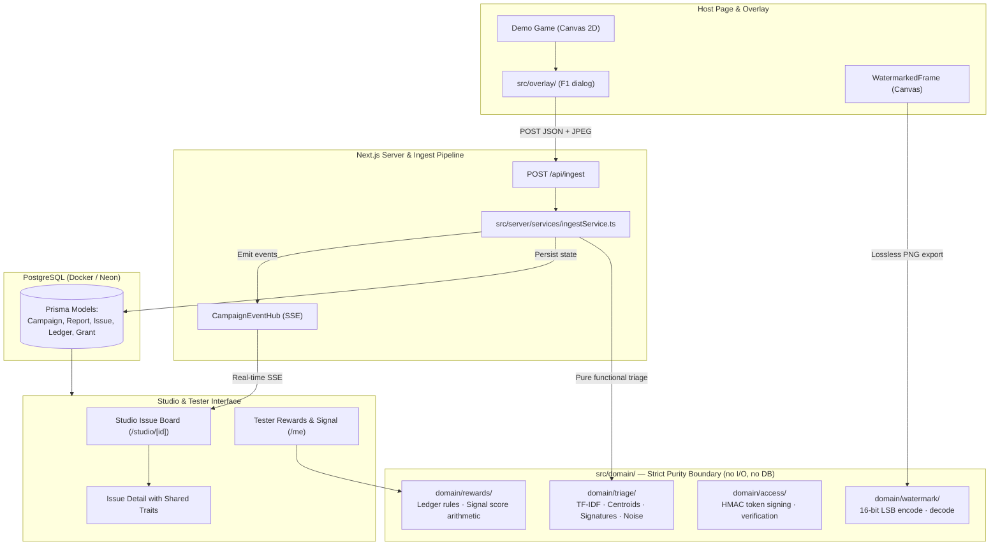

# Repro

Repro turns raw playtest bug reports into clustered, triaged issues a developer can actually fix — with forensic watermarking, reward tokens, and a live triage board, all running offline.


## Live Demo

- **Web**: [https://repro-team-omzo.vercel.app](https://repro-team-omzo.vercel.app)

## Quick Start

Working from a cold clone. Node 20 required (see `.nvmrc`). Runs completely offline.

```bash
cp .env.example .env                          # fill in secrets
pnpm install && pnpm db:up && pnpm db:migrate dev
pnpm dev                                      # http://localhost:3000
```

`SESSION_SECRET`, `ACCESS_SECRET` and `APP_SALT` are validated wherever they
are used. Blank, whitespace, or shorter than 32 characters is refused rather
than substituted, and anything that is not explicitly `NODE_ENV=development`
or `test` is treated as production — so a deploy that forgets one fails to
start instead of signing with a key that is public in this repository. Left
blank locally, the dev server falls back to a clearly-marked development key
and warns once. Generate real ones with `openssl rand -base64 32`.

To seed 328 real fixture reports through the real ingest endpoint:

```bash
pnpm seed
```

## Architecture



The `src/domain/` boundary contains only pure functions: no Prisma, no React, no `fetch`, and no I/O. Enforced by automated test `tests/domain.purity.test.ts`.

## How the Triage Works

Triage collapses incoming bug reports using four distinct signals:

1. **Lexical (TF-IDF)** (weight: 0.45) — Cosine similarity over normalized tokens.
2. **Game State Proximity** (weight: 0.25) — Strict scene match (mismatch is a hard veto) plus Euclidean spatial distance on a bucketed 3D grid.
3. **Log Signature** (weight: 0.20) — Normalised error line signatures with numbers, hashes, and dynamic IDs stripped.
4. **Environment Overlap** (weight: 0.10) — GPU renderer, OS, and browser family tally overlap.

### Thresholds & Fallback

- Combined score **≥ 0.40**: automatically attach report to existing issue cluster.
- Combined score **0.25 – 0.40**: flagged as a _possible duplicate_ for studio confirmation.
- Combined score **< 0.25**: promoted as a new unique issue cluster.
- **Rule of Thumb**: _When in doubt, do not merge._ A duplicate issue is a minor inconvenience; a false merge hides a distinct bug.

### In-Memory Computation

IDF tables and cluster centroids are rebuilt entirely in memory on every ingest from cached `Report.tokens` arrays. Nothing about the vector space or centroid positions is persisted to the database. This is a deliberate simplification rather than a shortcut: it keeps the domain pure, guarantees 100% deterministic reproducibility, avoids stale embedding migrations, and requires zero external vector search infrastructure.

## Delivery Modes

A studio's unreleased build is the most sensitive asset it owns, and a team
that will not upload it to a platform that launched last week is exercising
correct judgement. So the product does not ask for the binary. It asks for a
link.

**Link-only is the default.** The studio pastes the URL of a build it already
distributes — itch.io, Steam Playtest, TestFlight, a Drive folder. Repro still
issues per-tester access, records who accepted the NDA, gates the link behind
a live grant, collects every report, runs the full triage and runs the reward
ledger. What it cannot do is watermark frames or stop a tester forwarding the
link, and that is said on the campaign form next to the choice rather than
buried in terms.

**Hosted** is the upgrade, and what it buys is the one thing a link cannot
give you: every rendered frame carries the tester's identity, so a leaked
screenshot names an account in seconds.

**Self-hosted** is a roadmap line, not built — the studio keeps the binary on
its own infrastructure and calls Repro to validate each grant before serving
it. It is the answer for a studio that will never upload anything to anyone.

<!-- capability-matrix:start -->

| Capability                                      | Link only | Hosted — web | Hosted — download |
| ----------------------------------------------- | --------- | ------------ | ----------------- |
| Reachable only with a live, browser-bound grant | yes       | yes          | yes               |
| NDA acceptance recorded against a person        | yes       | yes          | yes               |
| Every attempt written to an append-only log     | yes       | yes          | yes               |
| Every rendered frame names the tester           | no        | yes          | no                |
| Link dies on first use                          | no        | no           | yes               |
| Stops a tester passing the build on             | no        | no           | no                |

<!-- capability-matrix:end -->

The last row is `no` everywhere and stays that way. Protecting a file on
someone else's machine is unsolved, and we do not claim to solve it. The table
is generated from `src/domain/campaigns/delivery.ts` and
`tests/delivery.test.ts` fails if this copy drifts from the code.

## Security Layers

- **Authenticated Ingest**: `POST /api/ingest` derives the reporter from a signed build access token (bearer) or the first-party session cookie. The request body carries no reporter identity at all — a client-supplied one is an impersonation primitive, and the reporter drives both noise penalties and reward payouts. Rate limited per principal _and_ per address.
- **Gated Build Delivery**: A build is reachable only through `GET /api/access/[token]/build`, which re-checks the grant and the browser binding, records the attempt, and redirects. The destination URL is never returned to the client, so there is no copy to replay after the grant expires. Single use means single _delivery_ — validating a token to render a page no longer spends a download link.
- **Append-Only Access Log**: Every attempt, granted or refused, is one immutable `AccessEvent` row. A run of `DENIED_UA_MISMATCH` against one grant is a link being passed around — the signal a studio wants before the build is on a torrent site, not after.
- **Build URL Validation**: A studio-supplied build URL becomes a redirect target on our own origin, so `javascript:`/`data:` schemes, protocol-relative `//host` values and plain `http` (except loopback) are refused on create _and_ on update.
- **Fail-Closed Secrets**: No secret has a fallback value. A missing or weak key stops the process rather than silently downgrading to a committed default.
- **Layered Login Throttling**: Per-address _and_ per-account token buckets, so a pool of addresses cannot be used to grind a single account. The account bucket is keyed on a hash of the normalised email, never the email itself.
- **Signed Build Access**: HMAC-SHA256 signed access tokens with a 15-minute TTL, cryptographically bound to the tester's User-Agent SHA-256 hash. Copying access links to another device or browser is immediately rejected.
- **NDA Fingerprinting**: Server-side age gate (`birthDate` verification for ≥ 18), storing cryptographic hashes of the signed legal text so neither party can alter terms post-facto.
- **Forensic Watermarking**: Embeds a 16-bit identity (giving a ceiling of **65,535 distinct grants**) into frame pixel luminance (±2 delta). Highly resilient to 2× and 3× downscaling.
- **Lossless vs. Lossy Distinction**: Bug report screenshots are client-compressed JPEGs (≤ 1280px, q0.8) and carry **no watermark**. Only raw, uncompressed PNGs exported via "Export frame for forensics" carry the watermark.
- **Mode-Accurate Claims**: The watermark badge, the tester session surface and the campaign preview all read one capability table. A build we do not render never claims a watermark, and a test keeps "prevents forwarding" false in every mode.
- **Honest Limits**: Client-side watermarking and token validation can be bypassed by an adversary with memory inspection or hardware capture tools. These layers raise the difficulty of casual leaks and establish accountability, not DRM perfection.

## Privacy

- **IP Addresses**: Hashed with a unique deployment salt (`APP_SALT`) prior to storage. Raw IPs are never written to disk or database.
- **Canvas-Only Capture**: Screenshots capture strictly the game's `<canvas>` element via `toDataURL()`. The tester's desktop, other browser tabs, and OS chrome are never accessed.
- **Data Minimization**: `birthDate` is checked in memory during NDA verification and never surfaced on public dashboards.
- **Virtual Claim Tokens**: Bounty rewards ("coins") are fictional claim tokens redeemable for in-game studio perks (alpha keys, credits mentions, cosmetics). They have no monetary exchange mechanism.

## Business Model

Repro sells to game studios: B2B SaaS, metered on the **active tester** —
someone who took a build in the billing period.

That metric tracks both things the product is for. Every active tester is one
watermark identity and one signed NDA record, so they are the leak surface;
and report volume, which is what triage saves a developer from reading, scales
with them roughly linearly. Developers on the studio's own team are unlimited
on every tier, because the value does not move with how many of them there are.

| Plan        | Price          | Campaigns | Active testers         | Reports   | Delivery         |
| ----------- | -------------- | --------- | ---------------------- | --------- | ---------------- |
| Playtest    | Free           | 1         | 50 / mo                | 500 / mo  | Link only        |
| Studio      | $49 / mo       | 5         | 500 / mo, then $0.15   | Unlimited | Link or hosted   |
| Publisher   | $199 / mo      | Unlimited | 2,500 / mo, then $0.08 | Unlimited | Link or hosted   |
| Self-hosted | Annual licence | Unlimited | Unlimited              | Unlimited | Your own network |

**Why $49 when the objection is "we have no budget"?** Because the comparison
is not $49 against zero. It is $49 against the two developer-days per test
cycle currently spent reading Discord threads and re-reading the same crash
report twelve times. A year of Studio costs less than one of those days.

Annual billing is ten months for twelve on Studio and Publisher. Going over an
allowance bills at the plan rate — it never blocks a playtest in progress,
because a dropped bug report is a worse outcome than a late invoice. Limits are
enforced where a campaign is created, not reported afterwards on a dashboard,
and nothing already running is ever stopped.

Reports are unmetered on every paid tier. Clustering gets _better_ with volume,
so billing per report would charge a studio for the product working.

Free is link-only: the tier where nothing of ours holds the studio's binary.
Hosting — and the frame watermarking that needs it — is what a studio pays to
get, which is also the land-and-expand story: paste a link on day one, and buy
hosting once the triage has already paid for itself.

### Models that were dropped first

- **Per developer seat.** The value does not move with it. A three-person team
  gets the same 400-reports-into-12-issues collapse as a fifty-person team from
  the same playtest, so seats would charge the studios getting the least the
  same as the studios getting the most.
- **Per report.** That charges for the behaviour the engine wants more of —
  clustering improves with volume, so it would price against the mechanism.
- **Per campaign.** Lumpy, and gamed by folding three playtests into one.
  A one-off per-campaign tier was considered and dropped for the same reason:
  it cannot be expressed as a subscription without lying to the row that backs
  it, and a monthly plan a studio can cancel already serves the team that ships
  twice a year.
- **A cut of the tester reward pool.** There is nothing to take a cut of. Coins
  are claim tokens for studio-provided perks with no monetary exchange
  mechanism, so inventing a cash flow there would contradict the product's own
  position and drag a developer tool toward money transmission.

The catalogue lives in `src/domain/billing/plans.ts` as pure, tested logic.
`/pricing` and the studio's own `/studio/billing` panel both read from it, so
the marketing page and the invoice cannot disagree about what a plan costs.

A studio's plan is persisted in `Subscription`, and every change is appended
to `SubscriptionEvent` with the user who made it. Usage accrues across a
period while a plan can change inside one, so the current plan alone cannot
rebuild an invoice — the history is what answers which plan was in force.
Self-hosted is not self-servable: it is an annual licence agreed with a
person. **No payment is taken in-app yet**; a plan change records an intent
and billing is invoiced separately.

## API Reference

Every route answers `404` rather than `403` where distinguishing the two would
confirm that an id exists.

| Method                 | Path                         | Auth                       | Purpose                                                                                                     |
| ---------------------- | ---------------------------- | -------------------------- | ----------------------------------------------------------------------------------------------------------- |
| `POST`                 | `/api/auth/register`         | —                          | Create a studio or tester account. Password entropy enforced.                                               |
| `POST`                 | `/api/auth/login`            | —                          | Exchange credentials for an httpOnly session cookie. Throttled per address and per account.                 |
| `POST`                 | `/api/auth/logout`           | —                          | Clear the session cookie.                                                                                   |
| `GET`                  | `/api/auth/me`               | session                    | Current session identity.                                                                                   |
| `GET`                  | `/api/campaigns`             | studio                     | Campaigns owned by the caller's studio.                                                                     |
| `POST`                 | `/api/campaigns`             | studio                     | Create a campaign. `402` when the plan does not cover the delivery mode or the campaign count.              |
| `GET` `PATCH` `DELETE` | `/api/campaigns/{id}`        | studio (owner)             | Read, update, revoke a campaign.                                                                            |
| `GET`                  | `/api/campaigns/{id}/board`  | studio (owner)             | Issues, raw report stream, and counts for the board.                                                        |
| `GET`                  | `/api/campaigns/{id}/events` | studio (owner)             | SSE stream of `report_ingested`, `issue_created`, `issue_updated`, `issue_verified`.                        |
| `GET` `POST`           | `/api/campaigns/{id}/nda`    | session                    | Read the NDA text; sign it (age gate, legal-name check).                                                    |
| `POST`                 | `/api/campaigns/{id}/access` | session                    | Issue a build access grant. Max 5 per rolling hour.                                                         |
| `GET`                  | `/api/access/{token}`        | grant token                | Validate a grant for the session surface. UA-bound, 15-minute TTL. Does not spend a single-use grant.       |
| `GET`                  | `/api/access/{token}/build`  | grant token                | The only door to a build. Re-checks the grant, records the attempt, redirects. Spends a download grant.     |
| `POST`                 | `/api/ingest`                | grant token **or** session | File a report. Reporter is taken from the credential.                                                       |
| `POST`                 | `/api/issues/{id}/verify`    | studio (owner)             | Verify an issue and release rewards.                                                                        |
| `POST`                 | `/api/reports/{id}/confirm`  | studio (owner)             | A held duplicate is the same bug.                                                                           |
| `POST`                 | `/api/reports/{id}/split`    | studio (owner)             | A held duplicate is its own issue.                                                                          |
| `POST`                 | `/api/billing/subscription`  | studio                     | Change the studio's plan. Records an intent; no payment is taken.                                           |
| `POST`                 | `/api/forensics/identify`    | studio                     | Recover a watermark from a lossless PNG. Returns `other_studio` with no PII if the grant belongs elsewhere. |

### Filing a report

```bash
curl -X POST http://localhost:3000/api/ingest \
  -H "content-type: application/json" \
  -H "authorization: Bearer $GRANT_TOKEN" \
  -d '{
    "campaignId": "seed-campaign",
    "body": "The lift jams halfway up and the game stops responding",
    "gameState": { "scene": "atrium", "x": 128, "y": 0, "z": 96, "playtimeSec": 74 },
    "systemInfo": { "os": "Windows", "browser": "Chrome", "gpuRenderer": "AMD", "screen": "1920x1080" },
    "consoleTail": [],
    "clientReportId": "optional-idempotency-key"
  }'
```

`201` for a new issue, `200` when the report was deduplicated into an existing
one, `401` without a usable credential, `422` on a shape mismatch, `429` when
the caller's bucket is empty (honour `Retry-After`).

## Test Coverage Summary

Repro maintains strict offline test coverage across unit, domain, and UI components:

```bash
# Run domain and UI test suites (345 passing tests)
pnpm test

# Run database integration tests (concurrency & idempotency against Postgres)
pnpm test:integration

# Full CI baseline validation
pnpm typecheck && pnpm lint && pnpm test
```

| Project       | Environment        | Scope                                                             |
| ------------- | ------------------ | ----------------------------------------------------------------- |
| `domain`      | Node.js            | Pure clustering, watermark encode/decode, token HMAC, reward math |
| `ui`          | jsdom              | React component behavior, IssueRow styling, renderers             |
| `integration` | Node.js + Postgres | 50-parallel verify idempotency, sequence allocation, transactions |

## Development Commands

| Command                 | Action                                                  |
| ----------------------- | ------------------------------------------------------- |
| `pnpm dev`              | Start Next.js local development server                  |
| `pnpm build`            | Production build                                        |
| `pnpm test`             | Run Vitest domain and UI test suites                    |
| `pnpm test:integration` | Run Postgres integration tests                          |
| `pnpm typecheck`        | Run `tsc --noEmit` under strict TypeScript              |
| `pnpm lint`             | Run ESLint across all source files                      |
| `pnpm format`           | Run Prettier code formatting                            |
| `pnpm db:migrate`       | Execute Prisma migrations against local Docker Postgres |
| `pnpm db:studio`        | Launch Prisma Studio database interface                 |
| `pnpm seed`             | Seed 328 reports via the HTTP ingest API                |

## Team

**Team Omzo** — Xsolla Baku GameTech Hackathon

- **Architecture & Domain Engine**: Pure triage clustering, TF-IDF lexical matching, signature deduplication
- **Security & Forensics**: 16-bit spatial watermark encode/decode, UA token binding, NDA integrity
- **Backend & Realtime**: Next.js 15 App Router, Prisma ORM, SSE live events with polling fallback
- **Frontend & Overlay**: Canvas 2D demo game, in-game bug overlay, design tokens system
